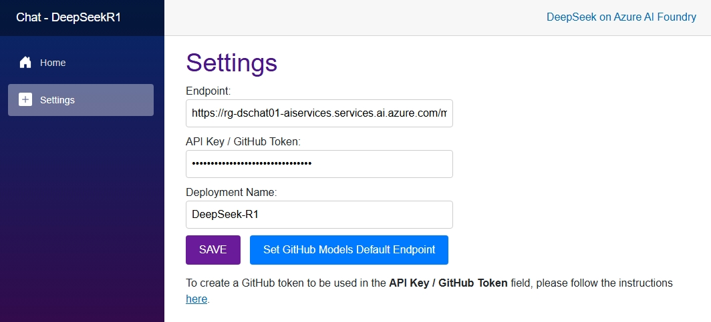
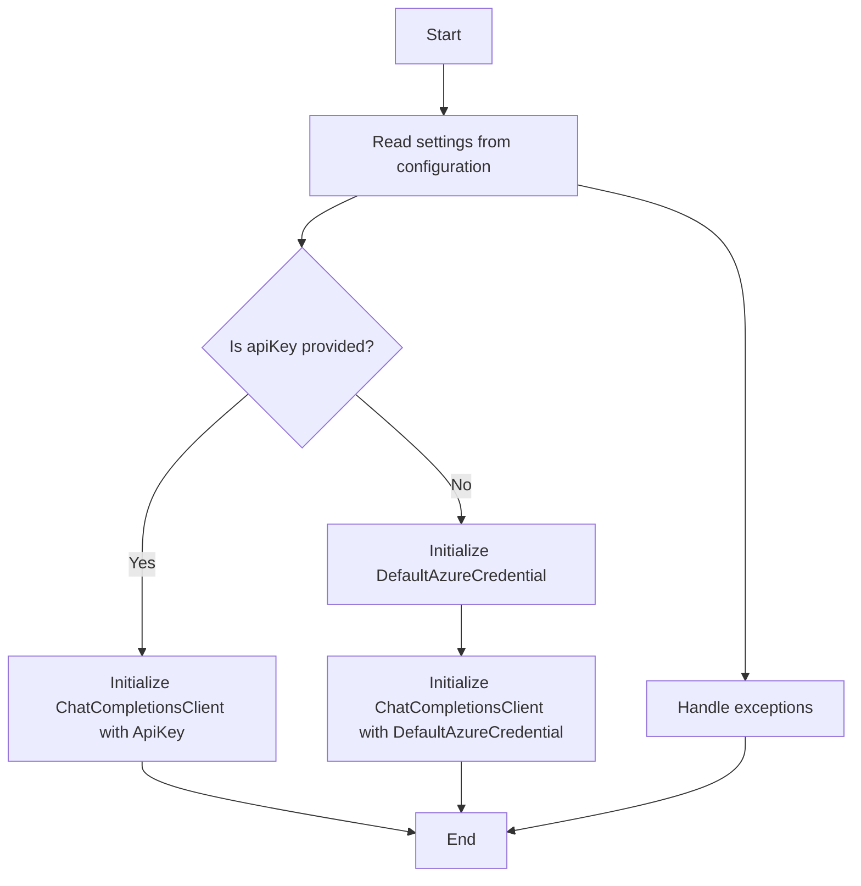

[](/LICENSE)
[](https://twitter.com/elbruno)


## Description

DeepSeek-R1 has been announced on [GitHub Models](https://github.blog/changelog/2025-01-29-deepseek-r1-is-now-available-in-github-models-public-preview/) as well as on [Azure AI Foundry](https://azure.microsoft.com/en-us/blog/deepseek-r1-is-now-available-on-azure-ai-foundry-and-github/), and the goal of this sample AI application is to demonstrate how to **use it with OpenAI SDK and .NET in Azure AI Foundry and GitHub Models**.

For a detailed step-by-step on how to use DeepSeek-R1 on GitHub Models and **Microsoft Extensions for AI**, check thr blog post [Build Intelligent Apps with .NET and DeepSeek R1 Today!](https://devblogs.microsoft.com/dotnet/start-building-an-intelligent-app-with-dotnet-and-deep-seek/). GitHub Models are easier to use (you just need a GitHub token, no Azure subscription required).

In this sample, we will use Azure AI Foundry and GitHub Models with DeepSeek-R1, both platforms uses same model and infrastructure.

- [Features](#features)
- [Architecture diagram](#architecture-diagram)
- [Prerequisites](#prerequisites)
- Run solution
  - [Run locally](#running-the-solution-locally)
  - [Deploy and run the solution in the cloud](#running-in-the-cloud-with-azure-container-apps-and-azure-ai-foundry)  
  - [C# Chat Client creation](#openai-client-creation)
- [Resources](#resources)
- [Guidance](#guidance)
  - [Costs](#costs)
  - [Security Guidelines](#security-guidelines)
- [Resources](#resources)

## Features

This is a sample chat demo that showcases the capabilities of DeepSeek-R1.

- There is a main Blazor web app that manages the chat interaction.
- The demo is orchestrated using .NET Aspire.
- The app also supports configuration settings to allow you to use your own DeepSeek-R1 deployment in Azure.
- The app shows the response from the reasoning model, and also the reasoning process that lead the model to that conclusion.

Below is a sample animation of the application running:


For more information, visit the [DeepSeek-R1 documentation](https://learn.microsoft.com/en-us/azure/ai/deepseek-r1).

## Architecture diagram

WIP - Coming soon!

## Prerequisites

Make sure the following tools are installed:

- [.NET 9](https://dotnet.microsoft.com/downloads/)
- [Git](https://git-scm.com/downloads)
- [Azure Developer CLI (azd)](https://aka.ms/install-azd)
- [VS Code](https://code.visualstudio.com/Download) or [Visual Studio](https://visualstudio.microsoft.com/downloads/)
  - If using VS Code, install the [C# Dev Kit](https://marketplace.visualstudio.com/items?itemName=ms-dotnettools.csdevkit)

### Running the solution locally

Run the BlazorChatDeepSeekR1.AppHost project:

```bash
cd ../BlazorChatDeepSeekR1.AppHost
dotnet run
```

### Running in the cloud with Azure Container Apps and Azure AI Foundry

The sample uses Azure AI Foundry with DeepSeek-R1, the most advanced model which needs advanced GPU and memory resources. You need to 

Deploy the solution to azure with the steps:

1. Login to Azure:

    ```shell
    azd auth login
    ```

1. Provision the AIServices resource with a DeepSeek-R1 deployment:

    ```shell
    azd up
    ```

1. The deploy process should take around 10 minutes. Once the deployment is complete, you will see the 2 URLs in the output.

    

1. Open the Aspire dashboard, and open the chat application.

### Get the EndPoint and ApiKey (optional) from the Azure AI Foundry deployment

To get the endpoint and API key for the Azure AI Foundry deployment, you must follow these steps:

- Open the Azure portal and navigate to the created resource group.

    

- Open the Azure AI Services Model deployment, these resource should start with the name `deepseekr1-...`.

- Click on open in Azure AI Foundry

    

- Select `Deployments` from the tree.

- Select the deployment for the DeepSeek-R1 model.

- In the model details, you will find the endpoint and the API key.

    

- Copy these values and apply them to the settings in the chat application.

    

- ***Note:** The endpoint url can be something similar to this: `https://<sample-deploy-name>.services.ai.azure.com/models/chat/completions?api-version=2024-05-01-preview`. The value that must be pasted in the settings is: `https://<sample-deploy-name>.services.ai.azure.com/models/`

### OpenAI Client creation

The OpenAI client is created in the `BlazorChatDeepSeekR1.Chat` project, in the `Program.cs` file.

The function `private void CreateChat()` is responsible for creating the OpenAI client. It validates the use of ApiKey and Endpoint, and creates the OpenAI client. If no ApiKey is provided, the client will use the default Azure Credentials.

Here is a simplified version of the code:
```csharp
private void CreateChat()
{
    // read the settings from the configuration
    endpoint = Configuration["endpoint"] ?? throw new ArgumentNullException("Endpoint");
    apiKey = Configuration["apikey"] ?? string.Empty;
    deploymentName = Configuration["deploymentname"] ?? "DeepSeek-R1";

    // validate if apiKey is provided and initialize the client
    if (string.IsNullOrEmpty(apiKey))
    {
        // Using DefaultAzureCredential for Managed Identity with models in Azure AI Foundry
        var options = new DefaultAzureCredentialOptions();
        var credential = new DefaultAzureCredential(options);
        client = new ChatCompletionsClient(
            endpoint: new Uri(endpoint),
            credential: credential
        );

    }
    else
    {
        // Using ApiKey works for models in Azure AI Foundry and GitHub Models
        client = new ChatCompletionsClient(endpoint: new Uri(endpoint), credential: new AzureKeyCredential(apiKey));
    }
}
```

The flow is as follows: 




## Guidance

### Costs

For **Azure OpenAI Services**, pricing varies per region and usage, so it isn't possible to predict exact costs for your usage.
The majority of the Azure resources used in this infrastructure are on usage-based pricing tiers.
However, Azure Container Registry has a fixed cost per registry per day.

You can try the [Azure pricing calculator](https://azure.com/e/2176802ea14941e4959eae8ad335aeb5) for the resources:

- Azure OpenAI Service: S0 tier, gpt-4o-mini and text-embedding-ada-002 models. Pricing is based on token count. [Pricing](https://azure.microsoft.com/pricing/details/cognitive-services/openai-service/)
- Azure Container App: Consumption tier with 0.5 CPU, 1GiB memory/storage. Pricing is based on resource allocation, and each month allows for a certain amount of free usage. [Pricing](https://azure.microsoft.com/pricing/details/container-apps/)
- Azure Container Registry: Basic tier. [Pricing](https://azure.microsoft.com/pricing/details/container-registry/)
- Log analytics: Pay-as-you-go tier. Costs based on data ingested. [Pricing](https://azure.microsoft.com/pricing/details/monitor/)
- Azure Application Insights pricing is based on a Pay-As-You-Go model. [Pricing](https://learn.microsoft.com/azure/azure-monitor/logs/cost-logs).

⚠️ To avoid unnecessary costs, remember to take down your app if it's no longer in use, either by deleting the resource group in the Portal or running `azd down`.

### Security Guidelines

Samples in this templates uses Azure OpenAI Services with ApiKey and [Managed Identity](https://learn.microsoft.com/entra/identity/managed-identities-azure-resources/overview) for authenticating to the Azure OpenAI service.

The Main Sample uses [Managed Identity](https://learn.microsoft.com/entra/identity/managed-identities-azure-resources/overview) for authenticating to the Azure OpenAI service.

Additionally, we have added a [GitHub Action](https://github.com/microsoft/security-devops-action) that scans the infrastructure-as-code files and generates a report containing any detected issues. To ensure continued best practices in your own repository, we recommend that anyone creating solutions based on our templates ensure that the [Github secret scanning](https://docs.github.com/code-security/secret-scanning/about-secret-scanning) setting is enabled.

You may want to consider additional security measures, such as:

- Protecting the Azure Container Apps instance with a [firewall](https://learn.microsoft.com/azure/container-apps/waf-app-gateway) and/or [Virtual Network](https://learn.microsoft.com/azure/container-apps/networking?tabs=workload-profiles-env%2Cazure-cli).

## Resources

- [Deploy a .NET Aspire project to Azure Container Apps using the Azure Developer CLI (in-depth guide)](https://learn.microsoft.com/dotnet/aspire/deployment/azure/aca-deployment-azd-in-depth)

- [Aspiring .NET Applications with Azure OpenAI](https://learn.microsoft.com/shows/azure-developers-dotnet-aspire-day-2024/aspiring-dotnet-applications-with-azure-openai)

- [DeepSeek-R1 is now available on Azure AI Foundry and GitHub](https://azure.microsoft.com/en-us/blog/deepseek-r1-is-now-available-on-azure-ai-foundry-and-github/?msockid=1f1ab8a22fcf6b370b36add42e5b6aa3)

- [DeepSeek-R1 Model Card - Azure AI](https://ai.azure.com/explore/models/DeepSeek-R1/version/1/registry/azureml-deepseek?tid=e47e6fc9-3a2c-454a-8b8f-90cc6972fb77)

## Related samples

- [DeepSeek on Azure](https://github.com/Azure-Samples/DeepSeek)
