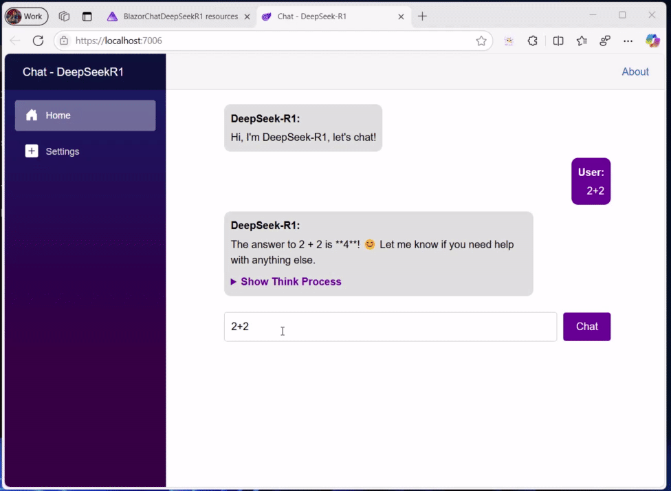
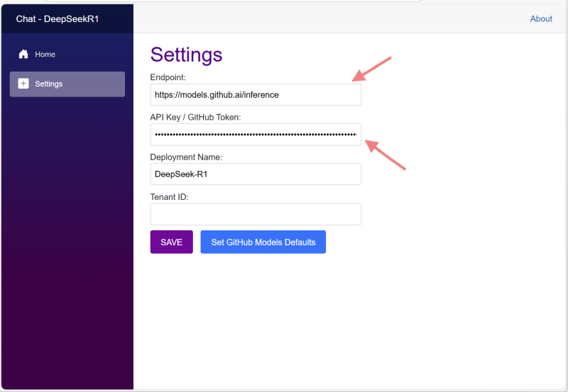
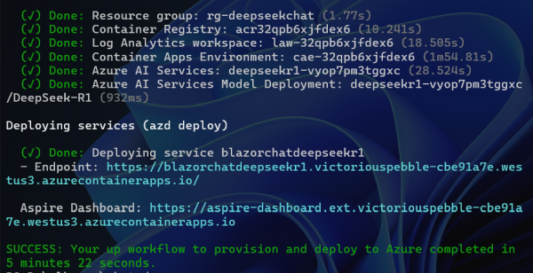
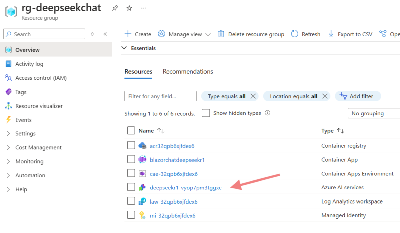
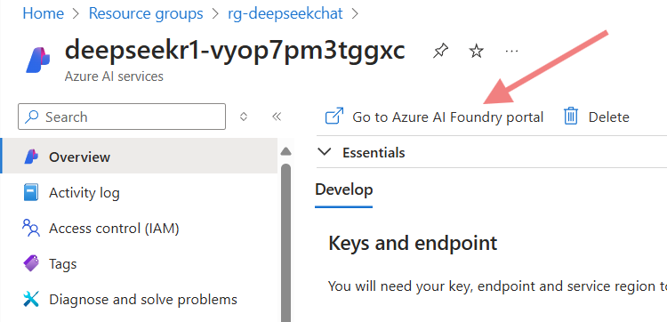
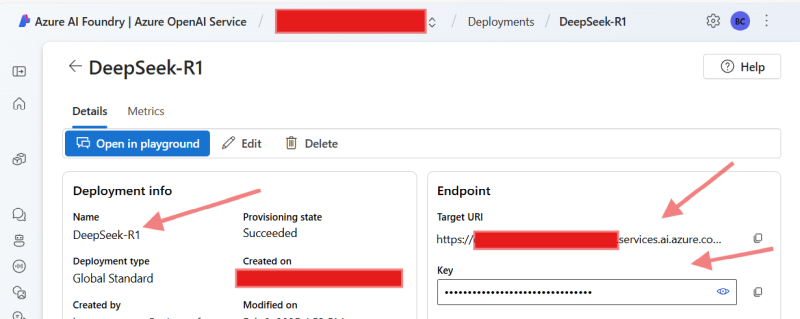

# DeepSeek-R1 with .NET on Azure AI Foundry and GitHub Models

## Introduction

DeepSeek-R1 has been announced on [GitHub Models](https://github.blog/changelog/2025-01-29-deepseek-r1-is-now-available-in-github-models-public-preview/) as well as on [Azure AI Foundry](https://azure.microsoft.com/en-us/blog/deepseek-r1-is-now-available-on-azure-ai-foundry-and-github/), and the goal of this sample AI application is to demonstrate how to **use it with Azure AI Inference SDK and .NET in Azure AI Foundry and GitHub Models**.

For a detailed step-by-step on how to use DeepSeek-R1 on GitHub Models and **Microsoft Extensions for AI**, check thr blog post [Build Intelligent Apps with .NET and DeepSeek R1 Today!](https://devblogs.microsoft.com/dotnet/start-building-an-intelligent-app-with-dotnet-and-deep-seek/). GitHub Models are easier to use (you just need a GitHub token, no Azure subscription required).

In this sample, we will use Azure AI Foundry and GitHub Models with DeepSeek-R1, both platforms uses same model and infrastructure.

## About this demo project

This is a Blazor WebApp project that demonstrates how to use DeepSeek-R1 on Azure with [Azure Inference client library for .NET](https://learn.microsoft.com/en-us/dotnet/api/overview/azure/ai.inference-readme?view=azure-dotnet-preview).

This is a sample chat demo that showcases the capabilities of DeepSeek-R1.

- There is a main Blazor web app that manages the chat interaction.
- The demo is orchestrated using .NET Aspire.
- The app also supports configuration settings to allow you to use your own DeepSeek-R1 deployment in Azure.
- The app shows the response from the reasoning model, and also the reasoning process that lead the model to that conclusion.

Below is a sample animation of the application running:



For more information, visit the [DeepSeek-R1 documentation](https://learn.microsoft.com/en-us/azure/ai/deepseek-r1).

## Prerequisites

Make sure the following tools are installed:

- [.NET 9](https://dotnet.microsoft.com/downloads/)
- [Git](https://git-scm.com/downloads)
- [Azure Developer CLI (azd)](https://aka.ms/install-azd)
- [VS Code](https://code.visualstudio.com/Download) or [Visual Studio](https://visualstudio.microsoft.com/downloads/)
  - If using VS Code, install the [C# Dev Kit](https://marketplace.visualstudio.com/items?itemName=ms-dotnettools.csdevkit)

## Configuration

To run the app locally you must set the user secrets for:

- **Endpoint**: defines the Azure AI Endpoint to be used where the model is deployed. The value should be similar to `https://<your deployment>.services.ai.azure.com/models/`
- **(optional) DeploymentName**: the default value is `DeepSeek-R1`, represents the name of the deployment.
- **(optional) ApiKey**: Represents the API key to access the model.
- **(optional) TenantID**: Represents the Tenant ID to access the model.

### Running the solution locally

Set the necessary secrets using this command:

```bash
cd ./src/BlazorChatDeepSeekR1.Chat

dotnet user-secrets init
dotnet user-secrets set "endpoint" "https://<your deployment>.services.ai.azure.com/models/"
dotnet user-secrets set "deploymentname" "DeepSeek-R1"
dotnet user-secrets set "apikey" "<your API KEY>"
dotnet user-secrets set "tenantid" "<your tenant id>"
```

Run the BlazorChatDeepSeekR1.AppHost project:

```bash
cd ../BlazorChatDeepSeekR1.AppHost
dotnet run
```

### Running in the cloud with GitHub Models

The sample uses GitHub Models with DeepSeek-R1:671b, the most advanced model which needs advanced GPU and memory resources

It is enabled by settings the `endpoint` and `apikey` user secrets to the following values:

- **Endpoint**: `https://models.github.ai/inference`
- **ApiKey / GitHub Token**: `<your GitHub token>`

To authenticate with the model you will need to generate a personal access token (PAT) in your GitHub settings. Create your PAT token by following instructions here: https://docs.github.com/en/authentication/keeping-your-account-and-data-secure/managing-your-personal-access-tokens



### Running in the cloud with Azure Container Apps and Azure AI Foundry

The sample uses Azure AI Foundry with DeepSeek-R1, the most advanced model which needs advanced GPU and memory resources. You need to 

Deploy the solution to azure with the steps:

1. Login to Azure:

    ```shell
    azd auth login
    ```

1. Provision the AIServices resource with a DeepSeek-R1 deployment:

    ```shell
    azd up
    ```

1. The deploy process should take around 10 minutes. Once the deployment is complete, you will see the 2 URLs in the output.



1. Open the Aspire dashboard, and open the chat application.

### Get the EndPoint and ApiKey for the Azure AI Foundry deployment

To get the endpoint and API key for the Azure AI Foundry deployment, you must follow these steps:

- Open the Azure portal and navigate to the created resource group.



- Open the Azure AI Services Model deployment, these resource should start with the name `deepseekr1-...`.

- Click on open in Azure AI Foundry



- Select `Deployments` from the tree.

- Select the deployment for the DeepSeek-R1 model.

- In the model details, you will find the endpoint and the API key.



- Copy these values and apply them to the settings in the chat application.

## Related samples

- [DeepSeek on Azure](https://github.com/Azure-Samples/DeepSeek)
